# Notify
Android App for making written, audio recorded and drawing notes.

## Built With

1. Kotlin
2. Firebase 
3. Auth
4. Firestore
5. RxJava
6. MVVM-Dependcy Injection
7. Material Designs

## Authors

* [Andrew Chelimo](https://www.linkedin.com/in/andrew-chelimo-63ba441b6/)
* [Muhammad Ramadan](https://www.linkedin.com/in/m7mdramadandx/)

## Screenshots for the App

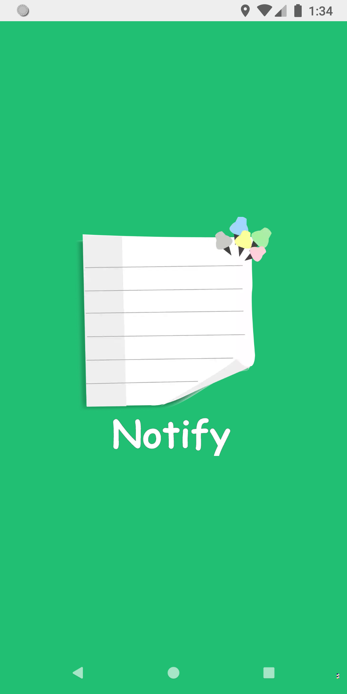 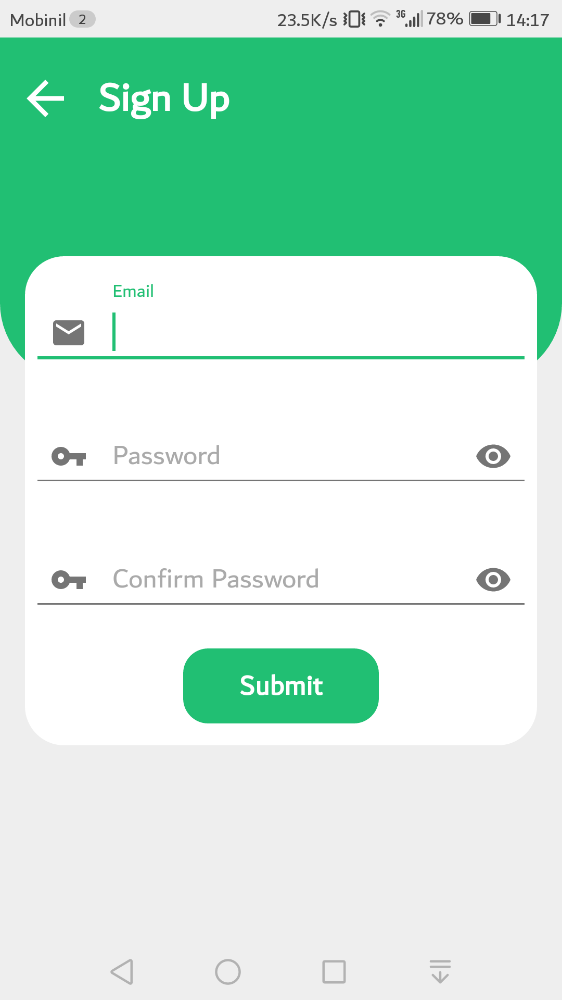 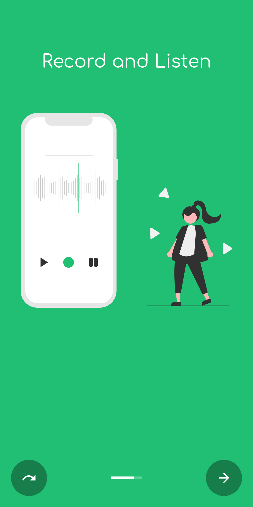

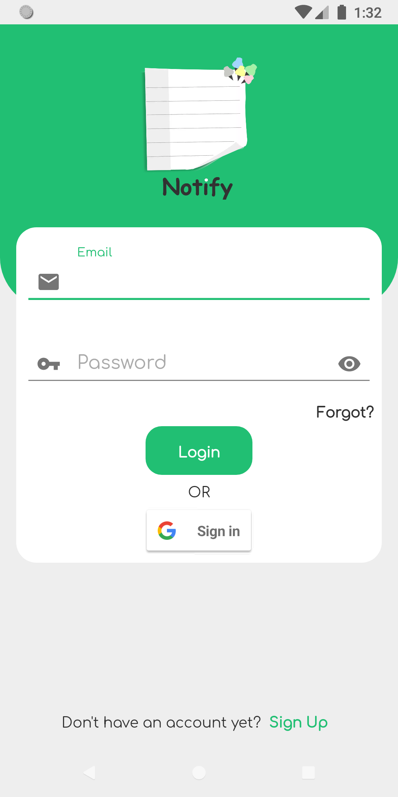 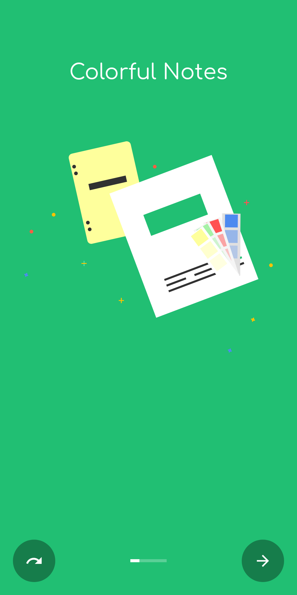 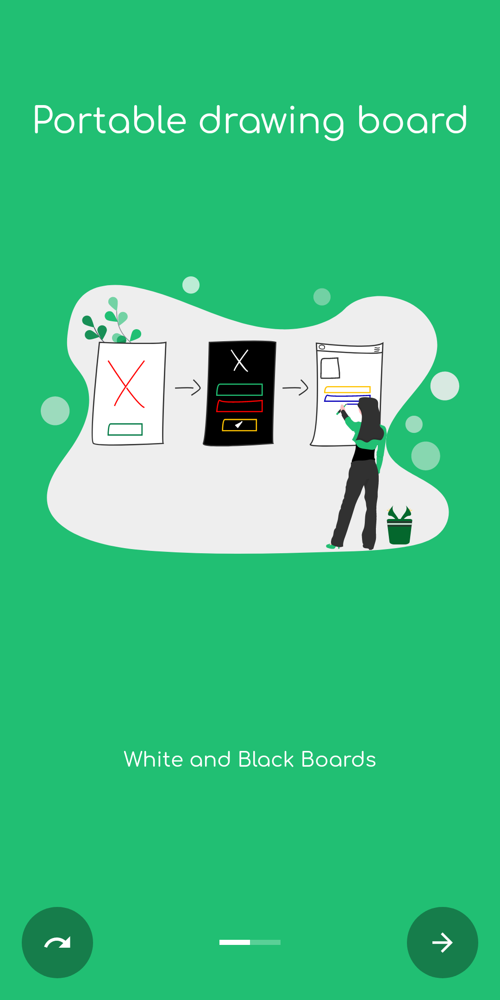

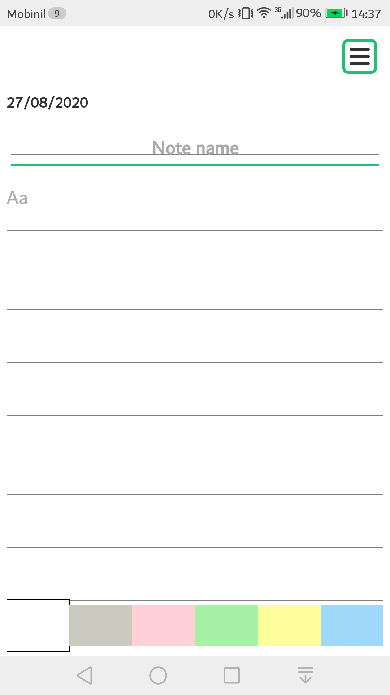 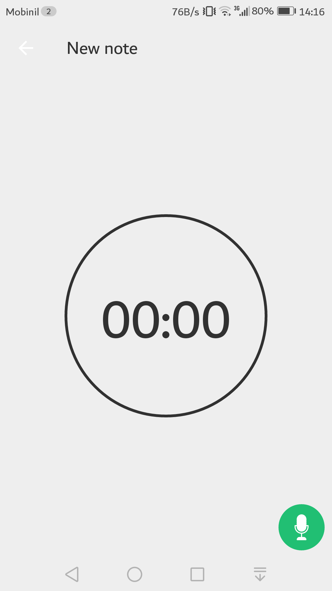 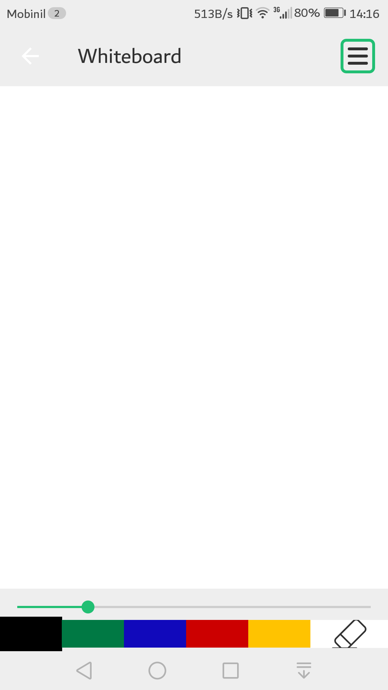

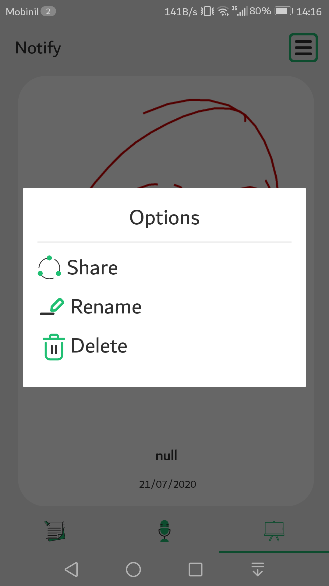 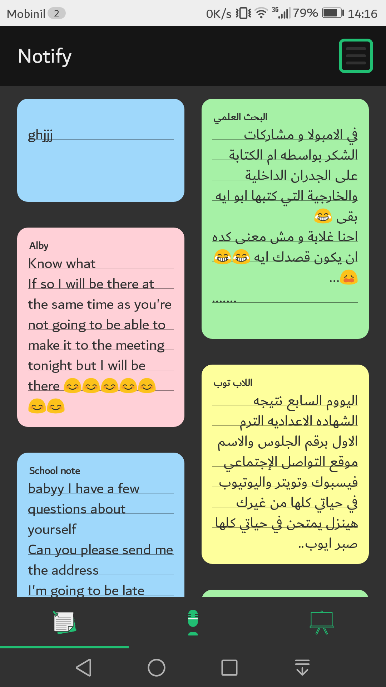 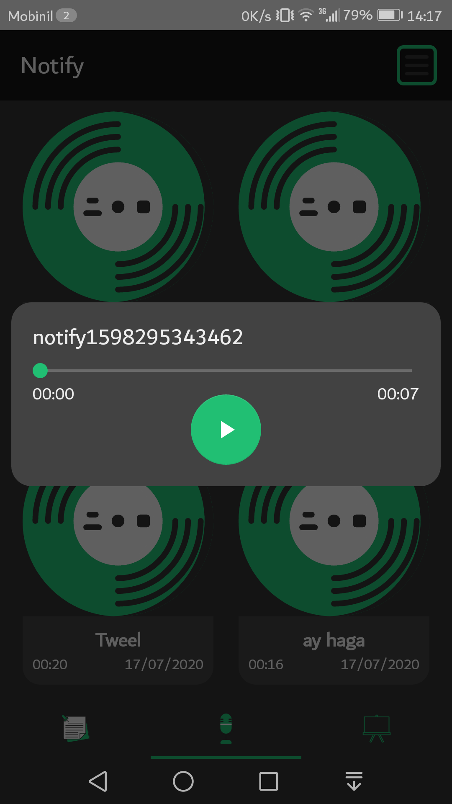
